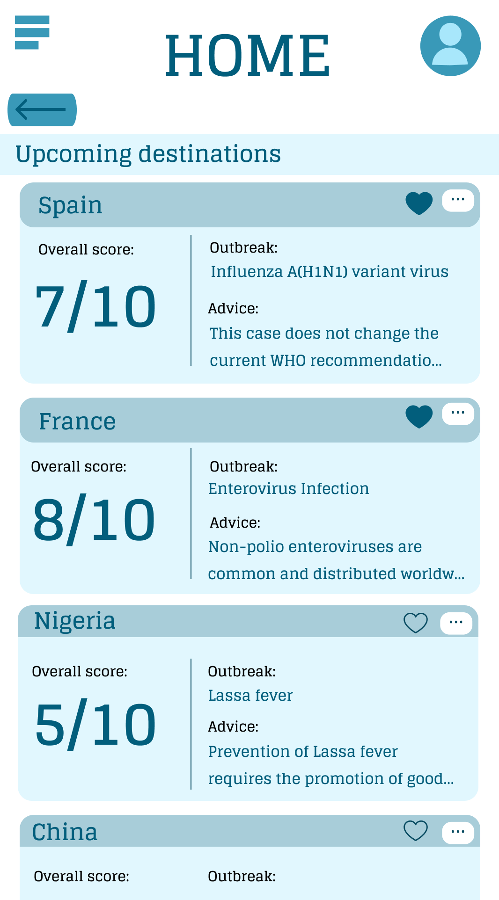

# Travel Checker – Health Advisory Platform

A health advisory platform designed to provide travellers with personalised health risk insights by transforming complex epidemiological data collected from WHO (World Health Organisation) into clear, actionable guidance.

## Prototype Preview

## Interactive Prototype

[View Interactive Figma Prototype](https://www.figma.com/design/XlxgWM7X55S722yVyKcnEs/Travel-Checker?node-id=0-1&t=Mc0gqLIAPRPjLdz3-1)

## Project Overview

Travel Checker is a health advisory platform designed to help travellers make informed decisions about international travel risks.

The system transforms complex epidemiological data from global health organisations into accessible, actionable recommendations. By integrating health data sources with a structured advisory interface, the platform enables users to quickly understand potential health risks associated with travel destinations.

The prototype explores how serverless cloud architecture, automated data ingestion, and intuitive user interfaces can support scalable and reliable health advisory systems.

## Tools & Technologies

- Python
- JSON Data Processing
- AWS Lambda
- Terraform
- AWS CloudWatch
- Figma (UX/UI Prototyping)
- Git & Version Control

## Key Features

- Destination-based health risk assessment
- Transformation of epidemiological datasets into user-friendly insights
- Cloud-based backend services using serverless infrastructure
- Automated data ingestion and transformation workflows
- Interactive interface for exploring travel health recommendations
- Clear visual communication of risk levels and guidance

## System Architecture

- **Serverless backend architecture** using AWS Lambda
- **Infrastructure as Code** deployment using Terraform
- **JSON-based data integration** for importing global health datasets
- **Cloud monitoring and observability** through AWS CloudWatch
- **Scalable cloud infrastructure** designed for large-scale travel data queries

## Design Principles

- **Information clarity** by translating complex epidemiological data into simple guidance
- **User accessibility** through clear visual communication of health risks
- **Data transparency** through the use of datasets from WHO
- **Intuitive exploration** of destination-based health risks through structured interface flows

## Repository Note

This project was originally developed in a private GitLab repository hosted by the university. After graduation, access to the repository expired and the full codebase is no longer available. This repository contains a reconstructed version of the system that demonstrates the development approach and architectural improvements used in the project.

## Author

Sneha Besu  
